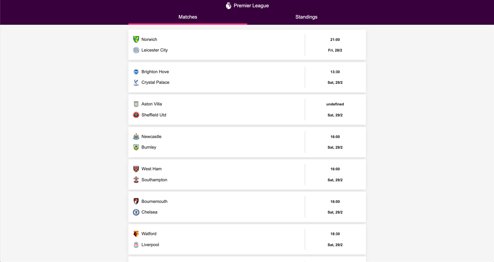
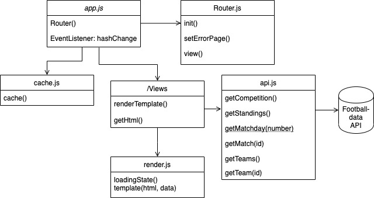
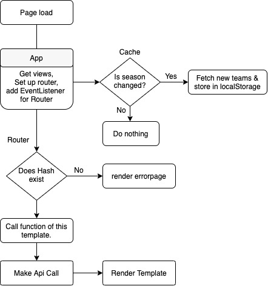

<h1 align="center">Web App From Scratch @cmda-minor-web 1920</h1>
<p align="center">A web application that displays this weeks Premier League (football) matches that gets updated frequently (at most a 5 min. delay when matches are in play). A detail view of the match and a page with the standings of the Premier League, this one is not live but gets updated after every match.</p>
<p align="center">Data is fetched from: <a href="https://football-data.org">Football-data Api</a> (free tier).</p>

<br />



<!-- Maybe a table of contents here? 📚 -->
## Table of contents

- [Installation](#installation)
    - [Authentication](#authentication)
    - [Dependencies](#dependencies)
- [Interactions](#interactions)
- [Data](#data)
    - [Restrictions](#restrictions)
    - [Caching](#caching)
- [Architecture](#architecture)
    - [Actor Diagram](#architecture)
    - [Interaction Diagram](#architecture)
- [Checklist](#checklist)
- [Thoughts](#thoughts)
- [License](#license)

<!-- How about a section that describes how to install this project? 🤓 -->
## Installation
In the terminal, go to your desired folder.
```bash 
cd /~path 
```

Copy & paste in your terminal:

```bash 
git clone https://github.com/gijslaarman/web-app-from-scratch-1920.git && cd web-app-from-scratch-1920
```
(This immediately puts you inside the folder).

#### Authentication:
>Since this is a client-side only webapp my key is currently stored inside the javascript. *I beg you to use your own.*

Apply for a key here: [Registration page](https://www.football-data.org/client/register).
And edit in **api.mjs**: 
```js
settings: {
        url: 'https://api.football-data.org/v2',
        urlParams: {
            headers: { "X-Auth-Token": YOUR_KEY_HERE! }
        },
        premierLeagueId: '2021'
    }
```
Replace `YOUR_KEY_HERE!` with your key you got in your email.

<em>Go ham!</em>

#### Dependencies

There are no node modules or packages to be installed. But the app does make use of 📚 [dayJS](https://github.com/iamkun/dayjs).


A Micro library (2kb) alternative to MomentJs. To format time & calculate the difference between two days. It is requested in the HTML to make use of the CDN:

```html
<script src="https://cdnjs.cloudflare.com/ajax/libs/dayjs/1.8.20/dayjs.min.js"></script>
```

And easily used with the function: ``dayjs()``.

## Interactions
There currently aren't a lot of interactions. The user can:
- **Look up the standings.** <em>(This currently doesn't link to a detailview of a team).</em>
- **See an overview of this weeks <em>(matchday)</em> matches.**
- **Get a detail view of a match.**

<!-- What external data source is featured in your project and what are its properties 🌠 -->
## Data
Data fetched from: [Footbal-data](https://www.football-data.org/). It is able to give you data of up to 147 competitions in the whole world. I only needed the Premier League of England, that was in the free tier. 


##### Restrictions:
Not all data is available for the free tier, things excluded:
    - **No Live data**
    - **Barely any Match data**
    - **10 calls per minute per key**

Most of this would be very important to see the live score, that's why the match details are quite empty currently.

*The Api is split in a lot of endpoints:*

> Each block represents an endpoint.

So I created a bunch of methods in the Api-module to make it easier to fetch data:
- `getCompetition()`: Get an overview of the Premier League, current matchday & previous winners etc.
- `getStandings()`: Tables of the current standings.
- `getMatchday(No.)`: Get matches of specific matchday. With the 'No.'-parameter you can add/subtract one week. E.g: It's matchday 27 and you want to retrieve matchday 26 you use `-1` as parameter. Leave empty to get this weeks matches. 
- `getMatch(id)`: Get information by match Id.
- `getTeams()`: Get all the Teams of the Premier League in current season.
- `getTeam(id)`: Get information of one team.

They all make us of the `makeReq()` method:
```js
makeReq: async (endpoint) => {
        const fetchCall = await fetch(`${apiCall.settings.url}${endpoint}`, apiCall.settings.urlParams)
        const jsonFormat = await fetchCall.json()
        return jsonFormat
    }
```
#### Caching
Since there are some factors where the data is not updated on the fly everytime we can store some variables. For example the teams. Thats what the cache file is for. If there's a new season it will update the teams in the localStorage.

##### Storing teams
Data fetched with `api.getTeams()` & stored in local storage per team:
```js
{
    id,
    name: 'Full Team name',
    shortName: 'Team commonly referred to',
    tla: 'Three letter abbreviation for team',
    crestUrl: 'Link to badge SVG',
    address,
    website,
    email,
    founded: 'year founded',
    clubColors: 'red / blue',
    venue,
    lastUpdated: 'Time object when this object last got updated.'
}
```

## Architecture
Made with [draw.io](https://draw.io).
#### Actor Diagram
<br/>



#### Interaction Diagram


## Checklist
- [x] Find Api
- [x] Read documentation
- [x] Render first template
- [x] Write router
- [x] Make architecture modular
- [x] Make new template
- [x] Write functions to render template
- [ ] Ability to cycle through matchdays
- [x] Loading state
- [x] ~~Rewrite functions 100x times.~~
- [x] Add styling
- [x] Make match detailview
- [ ] Add Head2Head on detailview
- [ ] Have a detailpage per team.
- [ ] Have team detailpage change color depending on team colors
- [ ] Refactor (~50% done)
- [ ] Have live data, and show that a match is live
- [x] Write README
- [x] Create Actor Diagram
- [x] Create Interaction Diagram
- [x] Write thoughts 💭in README

## Thoughts
I had a lot of fun making this project. Although missing almost an entire week because of a fever, I'm still semi happy with the result. I would have liked more information on the match detailpage, but in the end I spend a lot of time refactoring, thinking there's a better more readable solution to my functions.

## License
Web-app-from-scratch-1920: Premier League is licensed under a [MIT License](https://www.github.com/gijslaarman/web-app-from-scratch-1920/blob/master/LICENSE)